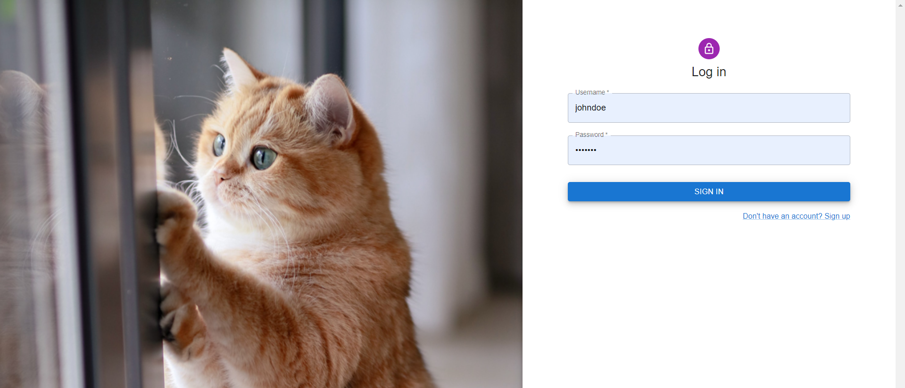
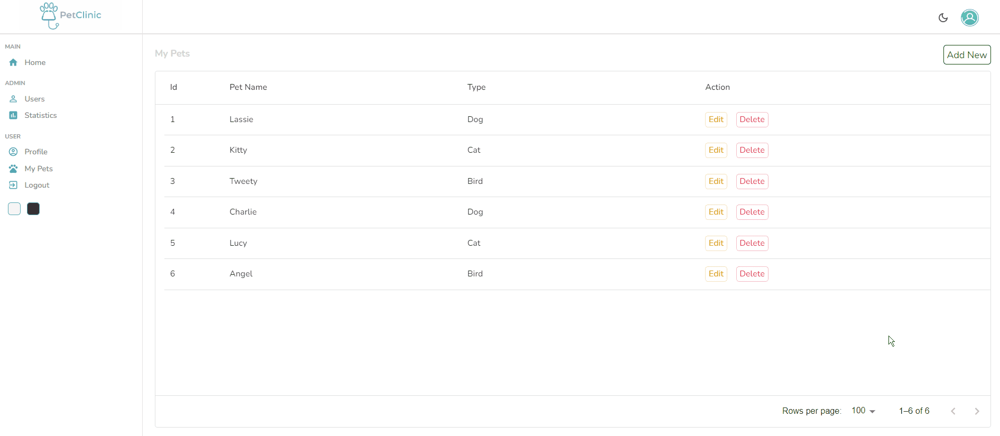
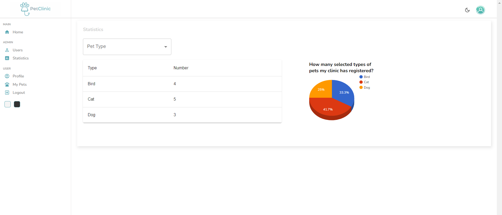

## WhiskerWelfare
Full stack web app with React, Spring Boot, Spring Security, Spring Data JPA, Hibernate, PostgreSQL, etc. Used for monitoring and managing vet and pet data.

 

### Description
This application allows users to register and login to the system using their credentials. Users can add any amount of their pets 
by providing name and type data.

Application users can also edit/delete their pets and own first/last name attributes. There is an Admin type user who has the full observation regarding Users and their pets.
Admin user has also a statistic page with data regarding how many selected types of pets the clinic has registered, access to user’s data and have ability to change any user
attribute, except username.

 

### Dependencies

* Spring Boot
* Spring Web
* Spring Security
* Spring Data JPA
* Lombok
* MapStruct
* PostgreSQL
* Flyway
* React
* Node.js
* Material UI

 

 
